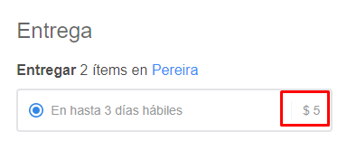

# KI-532487

This script is a workaround to KI https://vtexhelp.zendesk.com/agent/tickets/532487.

You need to add the script to the checkout at the `checkout6-custom.js`.

This script takes local store configuration from `orderForm.clientPreferencesData.locale` and `orderForm.storePreferencesData.currencyCode` and apply these setting to the shipping price presented in `../checkout/#/cart`.

Additionally, this script takes the last two decimals out from the shipping preview.
